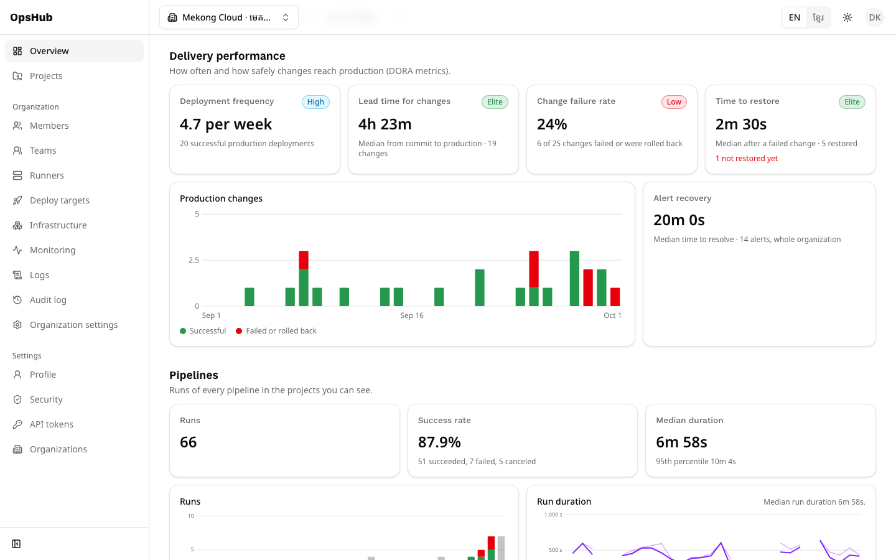
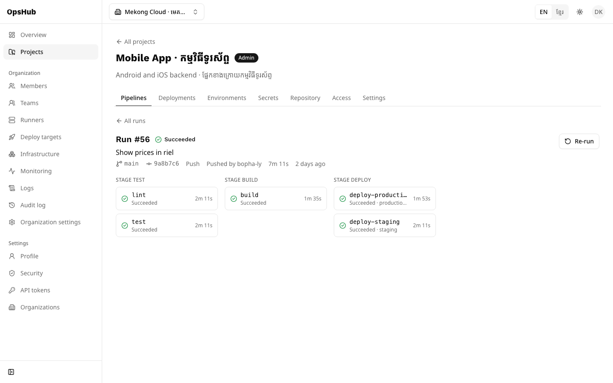
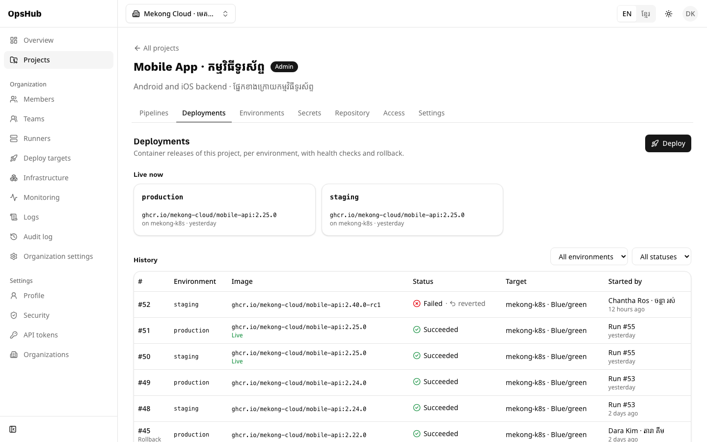
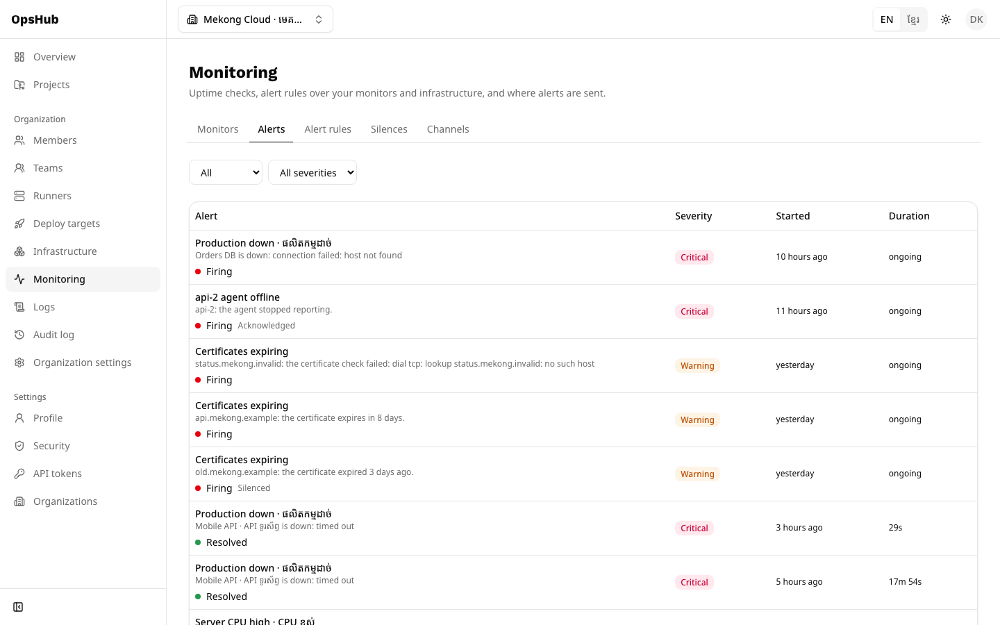
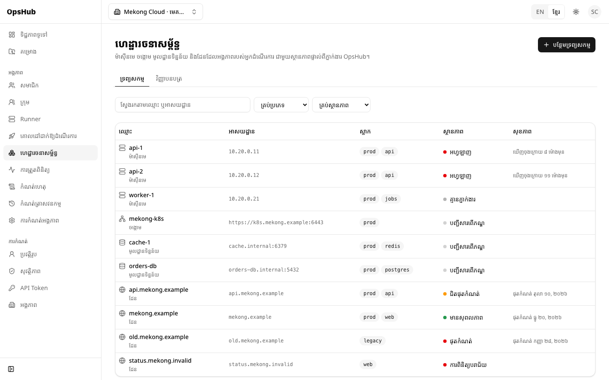

<div align="center">

# OpsHub

**The all-in-one DevOps platform you host yourself.**<br>
**វេទិកា DevOps គ្រប់មុខងារក្នុងមួយ ដែលអ្នកដំឡើងនៅលើម៉ាស៊ីនមេផ្ទាល់ខ្លួន។**

Pipelines · Deployments · Infrastructure · Monitoring · Logs · Secrets · Audit — in **English** and **ខ្មែរ**


[](LICENSE)

[Install](#install) · [Features](#features) · [Screenshots](#screenshots) · [Documentation](#documentation) · [ភាសាខ្មែរ](#ភាសាខ្មែរ)

</div>



## Install

All you need is [Docker](https://docs.docker.com/engine/install/).

### 1. Try it on your computer

Copy and run this command:

```bash
docker run -d \
  --name opshub \
  --restart unless-stopped \
  -p 8080:8080 \
  -v opshub-data:/data \
  ghcr.io/khempheara/opshub:latest
```

Then open **http://localhost:8080** and click **Create account**. To sign in before email is set
up, confirm your address with:

```bash
docker exec opshub opshub verify-email you@example.com
```

> **Want to look around first?** Add `-e OPSHUB_DEMO=true` to the command. OpsHub then starts with
> two demo organizations full of data. Sign in as `admin@demo.opshub.local`; the password is in
> the log: `docker logs opshub 2>&1 | grep password`.

### 2. Run it on your server, with HTTPS

Point a domain name at your server, open ports 80 and 443, then run:

```bash
docker run -d \
  --name opshub \
  --restart unless-stopped \
  -p 80:8080 \
  -p 443:8443 \
  -e OPSHUB_DOMAIN=ops.example.com \
  -e OPSHUB_ADMIN_EMAIL=you@example.com \
  -v opshub-data:/data \
  ghcr.io/khempheara/opshub:latest
```

Open **https://ops.example.com** (the certificate comes from Let's Encrypt automatically) and
create the account with the admin email: it becomes the platform administrator. Everyone else
joins by invitation.

**What you get in that one container:** the database, the API, the web app, HTTPS, and a backup
every night. Database passwords and encryption keys are generated on the first start and kept in
the `opshub-data` volume.

| Task | Command |
|---|---|
| See the logs | `docker logs -f opshub` |
| Check health and the latest backups | `docker exec opshub opshub status` |
| Back up now | `docker exec opshub opshub backup` |
| Upgrade | `docker pull ghcr.io/khempheara/opshub:latest`, `docker rm -f opshub`, then the same `docker run` again |

> [!IMPORTANT]
> Backups are encrypted. On the first start OpsHub creates the key and writes it to
> `/data/backup-private-key.txt`. Copy it somewhere safe off the server, then delete it there:
> `docker cp opshub:/data/backup-private-key.txt . && docker exec opshub rm /data/backup-private-key.txt`.
> Without it, backups can't be restored.

Email, single sign-on, runners, restoring a backup and every setting:
**[Docker install guide](docs/install-docker.md)**.

### Other ways to install

- **Several containers** (separate database, monitoring with Grafana, upgrades with one
  command): `./opshub install`, see the [guide](docs/install-docker.md#install-the-full-stack).
- **Kubernetes:** the Helm chart in `deploy/helm/opshub` ([guide](docs/helm.md)).

## Features

| | Feature | What it does |
|---|---|---|
| 🔐 | **Accounts & access** | Email + password, two-factor sign-in, GitHub/Google/Keycloak sign-in; organizations, teams and four roles |
| 📦 | **Projects** | Connect a GitHub or GitLab repository; environments with protection rules and approvals |
| ⚙️ | **CI/CD pipelines** | `.opshub.yml` with stages, a job graph, live logs, re-runs, schedules and approval gates |
| 🏃 | **Runners** | A small agent runs jobs in containers on your own machines |
| 🚀 | **Deployments** | Ship images to SSH hosts, Docker or Kubernetes; health checks, automatic revert, one-click rollback |
| 🖥️ | **Infrastructure** | Servers, clusters, databases and domains; live CPU, memory and disk; TLS certificate checks |
| 🔑 | **Secrets** | Encrypted, write-only values per project or environment, masked in logs |
| 🚨 | **Monitoring & alerts** | Uptime checks, alert rules, escalation to email, Slack, Telegram or webhooks, silences |
| 📜 | **Logs** | Search what your services, jobs and deployments write, with a live follow mode |
| 🕵️ | **Audit log** | Every change and sign-in, as sentences in English or Khmer, exportable to CSV |
| 📊 | **Dashboard** | The four DORA metrics, pipeline success and durations, per project |

Everything works in **English and Khmer**: switch with **EN | ខ្មែរ** in the top bar.

## Screenshots

<table>
  <tr>
    <td width="50%"><br><sub><b>Pipelines</b>: stages, jobs and approvals</sub></td>
    <td width="50%"><br><sub><b>Deployments</b>: what's live, history and rollbacks</sub></td>
  </tr>
  <tr>
    <td width="50%"><br><sub><b>Alerts</b>: firing, acknowledged, silenced, resolved</sub></td>
    <td width="50%"><br><sub><b>ខ្មែរ</b>: the whole interface in Khmer</sub></td>
  </tr>
</table>

## Security

- Passwords hashed with argon2id; two-factor sign-in; accounts lock after repeated failures.
- Secrets, deploy credentials and 2FA keys are encrypted (AES-256-GCM); they're never shown again.
- The audit log can't be changed, not even by the application's own database user.
- Every permission is checked on the server; other organizations' data answers "not found".
- Containers run without root, and backups are encrypted before they're written.

Details: [security model](docs/security.md) · [roles](docs/rbac.md) · [secrets](docs/secrets.md).

## Documentation

| Guide | About |
|---|---|
| [Install with Docker](docs/install-docker.md) | `docker run`, the full stack, HTTPS, email, backups, upgrades |
| [Pipelines](docs/pipelines.md) · [Runners](docs/runners.md) | Write `.opshub.yml`; run jobs on your machines |
| [Deployments](docs/deployments.md) · [Infrastructure](docs/infrastructure.md) | Deploy targets, rollbacks; servers, metrics, certificates |
| [Secrets](docs/secrets.md) · [Monitoring](docs/monitoring.md) · [Logs](docs/logs.md) | Encrypted values; alerts and channels; log search and ingest |
| [Audit log](docs/audit.md) · [Dashboard](docs/dashboard.md) | Who did what; DORA metrics |
| [Configuration](docs/configuration.md) · [Security](docs/security.md) | Every setting, production notes; how OpsHub protects data |
| [Backups](docs/backup.md) · [Observability](docs/observability.md) · [Helm](docs/helm.md) | Running OpsHub in production |
| [API](docs/api.md) · [Architecture](docs/architecture.md) · [Database](docs/database.md) | How it's built |

What changed in each version: [CHANGELOG.md](CHANGELOG.md).

## License

OpsHub is open source under the [MIT License](LICENSE): use, change and share it freely,
including in commercial products; keep the copyright notice.

## For developers

<details>
<summary><b>Run from source, test and contribute</b></summary>

<br>

Requirements: Docker, Go 1.26+, Node 22+.

```bash
make dev    # build and start the stack: http://localhost:3000
make seed   # demo data: "Angkor Tech" and "Mekong Cloud"
```

| URL | What |
|---|---|
| http://localhost:3000 | OpsHub |
| http://localhost:8080/docs | API reference (Swagger UI) |
| http://localhost:8025 | Mailpit: every email OpsHub sends |
| http://localhost:3001 | Grafana dashboards |

Demo accounts share the password `make seed` prints (or set `OPSHUB_SEED_PASSWORD`):
`owner@demo.opshub.local` (Khmer), `admin@…`, `dev@…` (Khmer), `viewer@…`, and `secure@…`
(two-factor sign-in). Sign-in opens Angkor Tech; switch to **Mekong Cloud** to see every page
full of data.

| Task | Command |
|---|---|
| Tests (Go, Vitest, i18n) | `make test` |
| End-to-end tests (needs `make dev` + `make seed`) | `make e2e` |
| Lint | `make lint` |
| Test the Docker installs | `make aio-test`, `make install-test` |
| Regenerate the API client and SQL code | `make gen` |
| Everything else | `make help` |

**Adding an endpoint:** describe it in `api/openapi.yaml` → SQL in `db/queries` → `make gen` →
service (permissions + audit) → handler → tests → error codes in `internal/apperr` and
`web/src/locales/{en,km}/errors.json` → UI text in both languages.

</details>

## ភាសាខ្មែរ

OpsHub ប្រមូលផ្តុំ CI/CD Pipeline ការ Deploy ហេដ្ឋារចនាសម្ព័ន្ធ ការត្រួតពិនិត្យ កំណត់ហេតុ Secret
កំណត់ត្រាសវនកម្ម និងផ្ទាំងរង្វាស់ DORA នៅក្រោមការចូលគណនីតែមួយ។ ចំណុចប្រទាក់ទាំងមូលមានជាភាសាខ្មែរ។

**សាកល្បងលើកុំព្យូទ័ររបស់អ្នក** (ត្រូវការតែ Docker ប៉ុណ្ណោះ)៖

```bash
docker run -d \
  --name opshub \
  --restart unless-stopped \
  -p 8080:8080 \
  -v opshub-data:/data \
  ghcr.io/khempheara/opshub:latest
```

បន្ទាប់មកបើក **http://localhost:8080** រួចបង្កើតគណនី។ ដើម្បីបញ្ជាក់អ៊ីមែលដោយមិនចាំបាច់មានម៉ាស៊ីនផ្ញើអ៊ីមែល៖

```bash
docker exec opshub opshub verify-email you@example.com
```

**ដំឡើងលើម៉ាស៊ីនមេជាមួយ HTTPS៖** បន្ថែម `-p 80:8080 -p 443:8443 -e OPSHUB_DOMAIN=ops.example.com
-e OPSHUB_ADMIN_EMAIL=you@example.com` ទៅក្នុងពាក្យបញ្ជាខាងលើ (សូមមើល [ផ្នែក Install](#install))។
វិញ្ញាបនបត្រ HTTPS និងការបម្រុងទុកដែលបានអ៊ិនគ្រីបរៀងរាល់យប់ ត្រូវបានរៀបចំដោយស្វ័យប្រវត្តិ។

ភាសា៖ ប្តូររវាង **EN | ខ្មែរ** នៅរបារខាងលើ។ ឯកសារលម្អិតមាននៅក្នុងថត `docs/` (ជាភាសាអង់គ្លេស)
និងសទ្ទានុក្រមពាក្យបច្ចេកទេសនៅ [docs/i18n.md](docs/i18n.md)។
