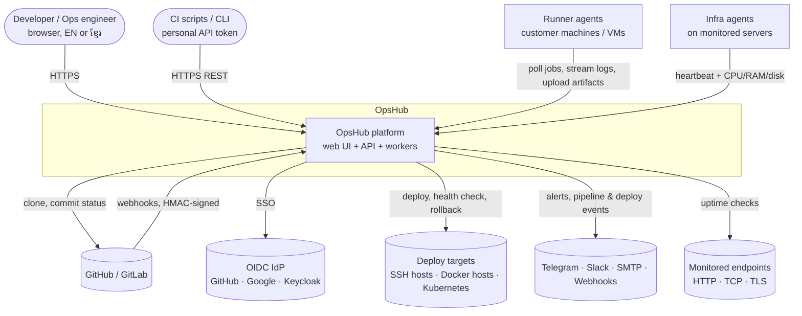
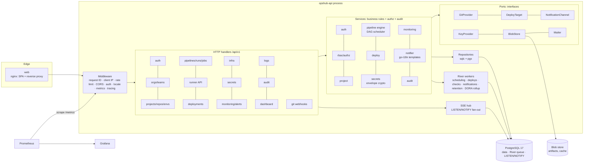
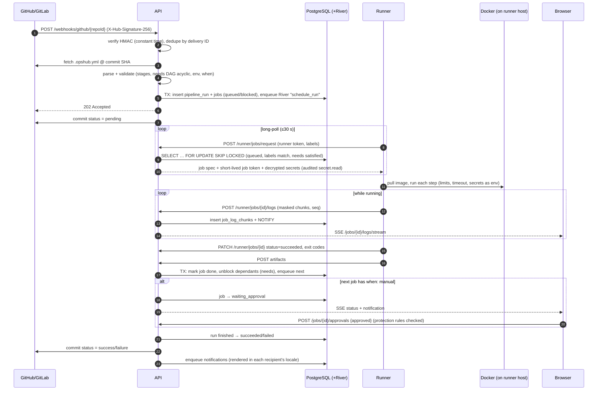
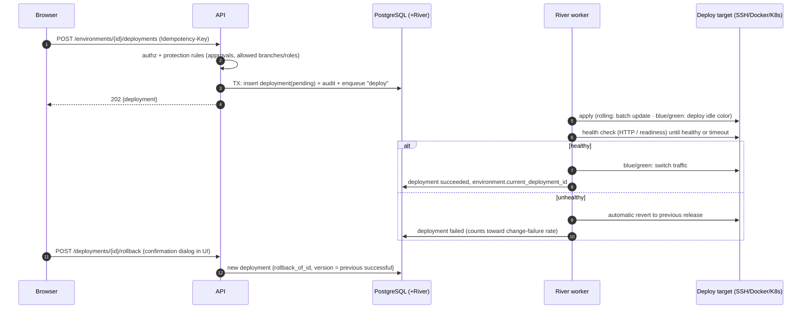
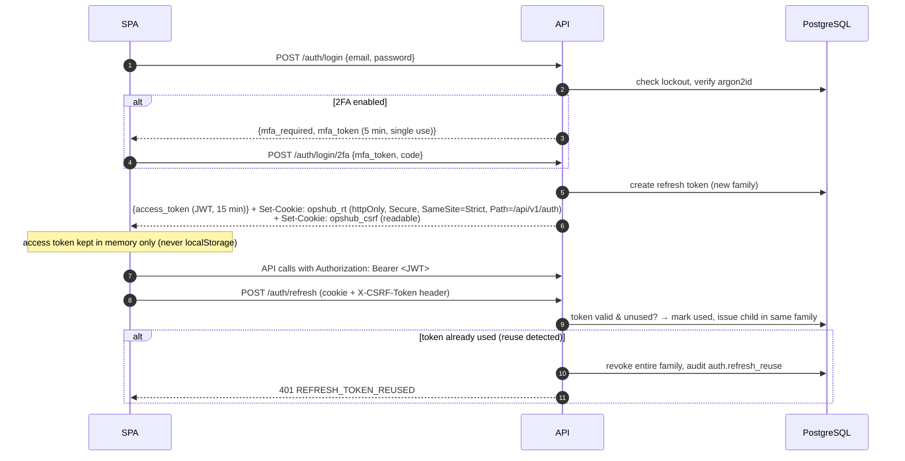

# OpsHub architecture

> Phase 0 plan. Companion documents: [API endpoints](api.md) · [Database](database.md) ·
> [RBAC](rbac.md) · [i18n](i18n.md) · [Delivery plan & open decisions](plan.md)

## 1. System context



Jobs from `.opshub.yml` **never run on the API host**. They run only on registered runners, each step
in an isolated container.

## 2. Containers & components



| Component | Notes |
|---|---|
| **API** (`cmd/api`) | Stateless, horizontally scalable. REST, SSE, runner/agent endpoints, webhooks. Also runs River workers in-process (can be split with `--role=worker`). |
| **River** | Postgres-backed job queue: jobs are enqueued **in the same transaction** as the change that caused them. Periodic jobs cover cron triggers, uptime checks, cert expiry, log retention, backups (optional) and DORA rollups. |
| **SSE hub** | Log chunks and status changes are written to Postgres, then `NOTIFY`'d; every API replica `LISTEN`s and fans out to its connected browsers. No sticky sessions or Redis needed. |
| **Runner** (`cmd/runner`) | Single Go binary. Registers once, long-polls for jobs, runs each step in a Docker container (CPU/memory limits, timeout, no privileged mode by default), masks secrets, uploads logs and artifacts. |
| **Infra agent** | Sends heartbeat and CPU/RAM/disk metrics. **See open decision D4** in [plan.md](plan.md). |
| **Web** | nginx serves the SPA and proxies `/api`, `/docs`, and SSE (unbuffered). |

## 3. Key sequences

### 3.1 Pipeline execution



Failure handling: runner heartbeats every 10 s. Jobs whose runner misses 3 heartbeats are marked
`failed (runner_lost)` and can be retried. Cancel sets `cancel_requested`, which the runner sees on
its next log/heartbeat response and then kills the containers.

### 3.2 Deployment & one-click rollback



### 3.3 Authentication (access JWT + rotating refresh cookie)



## 4. Folder tree

```
.
├── api/openapi.yaml                 OpenAPI 3.1: source of truth; drives orval client
├── cmd/
│   ├── api/                         API server (+ subcommands: migrate, seed, keys rotate)
│   └── runner/                      Runner agent
├── db/
│   ├── migrations/                  0000NN_<name>.{up,down}.sql, embedded in the API binary
│   ├── queries/                     sqlc queries, one file per module
│   └── seed/                        demo org/users/project (EN + KM text)
├── deploy/
│   ├── docker/                      api/runner/web/backup Dockerfiles, nginx.conf.template
│   ├── compose/                     prometheus.yml, grafana provisioning + dashboards
│   ├── helm/opshub/                 Helm chart (API with workers, web, migrations hook, backup CronJob)
│   └── backup/                      backup/restore/schedule scripts (pg_dump + age), restore drill
├── docs/                            architecture, api, database, rbac, i18n, plan, runbooks
├── internal/
│   ├── apperr/  config/  database/  httpx/  i18n/  logging/  telemetry/  server/   (platform)
│   ├── store/                       sqlc-generated (do not edit)
│   ├── authn/                       JWT, refresh tokens, API tokens, runner/agent tokens, CSRF
│   ├── authz/                       RBAC: role resolution + Require(ctx, action, resource)
│   ├── ratelimit/  idempotency/  pagination/  audit/  crypto/  blob/  mail/
│   ├── user/  org/  project/  gitprovider/{github,gitlab}/
│   ├── pipeline/{spec,engine}/  runnerapi/  sse/
│   ├── deploy/{ssh,docker,kubernetes}/  infra/  secret/
│   ├── monitor/  alert/  notify/{telegram,slack,email,webhook}/
│   ├── logs/  dashboard/  jobs/ (River workers)
│   └── runner/                      runner agent internals (executor, masker, uploader)
├── web/
│   ├── e2e/                         Playwright (login, run pipeline, deploy, rollback, language)
│   ├── scripts/check-i18n.mjs
│   └── src/
│       ├── app/                     router, route guards, providers, query client
│       ├── components/{ui,layout,common}/   shadcn/ui, sidebar/topbar, empty/error/confirm
│       ├── features/<module>/       pages + components + hooks per module
│       ├── i18n/                    setup, formatters, Khmer segmentation
│       ├── lib/api/                 fetcher (JWT, refresh, CSRF) + generated/
│       └── locales/{en,km}/*.json
├── docker-compose.yml               api, runner, postgres, web, prometheus, grafana, mailpit
├── Makefile                         dev test lint fmt gen migrate-up migrate-down seed build docker i18n-check
├── .env.example
└── README.md                        EN + ខ្មែរ summary
```

## 5. Backend layering (hexagonal)

```
handler  →  service  →  repository (sqlc)  →  PostgreSQL
 decode/validate   business rules, authz,       generated,
 render envelope   transactions, audit,         parameterized SQL
                   enqueue River jobs
                        └→ ports: GitProvider, DeployTarget, NotificationChannel, KeyProvider, BlobStore, Mailer, Clock
```

| Layer | Responsibility | Must not |
|---|---|---|
| Handler | Parse & validate (`httpx.Decode`), call one service method, render JSON / error envelope | Business rules, SQL, permission checks |
| Service | Rules, **authorization**, transactions, audit, jobs | Know about HTTP |
| Repository | Typed SQL generated by sqlc; every tenant query takes `organization_id` | Logic |
| Ports | Interfaces owned by the consuming package; fakes in tests | Leak SDK types |

## 6. Cross-cutting API conventions

| Concern | Design |
|---|---|
| **Errors** | `{"error":{"code","message","details"}}`; codes are stable and translated by the UI. Unknown errors become `INTERNAL`, cause logged only |
| **Validation** | `validate:` tags; `VALIDATION_FAILED` with `details.fields[{field,rule,param}]`; unknown JSON fields rejected; 1 MiB body limit (runner log/artifact endpoints have their own limits) |
| **Pagination** | Cursor-based on every list: `?limit=50&cursor=<opaque>` (max 200). Response `{ "items": [...], "next_cursor": "…" \| null }`. The cursor encodes the sort key plus id (keyset pagination, stable under inserts) |
| **Sorting** | `?sort=-created_at` (whitelist per endpoint; `-` = desc; id as tiebreaker) |
| **Filtering** | Explicit query params per endpoint (`status=failed&ref=main&from=…&to=…`); whitelisted, never raw SQL |
| **Idempotency** | `Idempotency-Key` header on POSTs that trigger runs, deployments and rollbacks. Stored per (user, key) for 24 h with a hash of method, path and body. A retry while the first request is running gets `409 IDEMPOTENCY_KEY_IN_PROGRESS`; 5xx responses aren't stored, so they can be retried. Replays return the original response; the same key with a different body returns `409 IDEMPOTENCY_KEY_REUSED` |
| **Optimistic locking** | Editable resources carry `version`. PATCH requires `If-Match: "<version>"` (ETag). Mismatch returns `409 VERSION_CONFLICT`; a missing header returns `428 PRECONDITION_REQUIRED` |
| **Transactions** | Multi-step writes (run creation, deployments, secret rotation, membership changes) run in one transaction together with their audit row and River enqueue |
| **Multi-tenancy** | Every tenant-owned table has `organization_id`; every repository query filters by it; services derive the org from the path resource, never from the body. A tenant-isolation test suite seeds two orgs and asserts that every endpoint returns 404 for the other org's IDs |
| **Rate limiting** | Token bucket per client IP (anonymous) and per user/token (authenticated), stricter on `/auth/*`. Headers: `RateLimit-Limit/Remaining/Reset`; `429 RATE_LIMITED` with `Retry-After`. Account lockout is persisted in Postgres (works across replicas) |
| **CORS** | Allow-list `OPSHUB_CORS_ALLOWED_ORIGINS` (empty by default: same-origin via nginx). Credentials allowed only for listed origins |
| **Context** | Request context flows to every DB call and outbound request; client disconnect cancels work; per-route timeouts |
| **Request IDs** | UUID or sanitized inbound `X-Request-Id`; included in logs and error logs |
| **Graceful shutdown** | Stop accepting, drain in-flight requests, close SSE streams, let River finish or release jobs, flush traces |
| **IDs/time** | UUID v7; `timestamptz` UTC; display conversion in the UI (default Asia/Phnom_Penh) |

## 7. Security (OWASP Top 10 mapping)

| OWASP | Controls |
|---|---|
| A01 Broken access control | Service-layer authz on every path; 404 for invisible resources; tenant isolation tests; route guards (UI convenience only) |
| A02 Cryptographic failures | argon2id (m=64 MiB, t=3, p=2); AES-256-GCM envelope encryption for secrets, TOTP seeds, repo tokens, target credentials; Ed25519-signed JWTs; TLS terminated at ingress |
| A03 Injection | sqlc parameterized SQL only; whitelisted sort/filter; React output encoding; shell steps run only on runners, never interpolated server-side |
| A04 Insecure design | Protection rules and approvals for production; confirmation dialogs; secrets write-only |
| A05 Misconfiguration | Strict CSP, `nosniff`, `X-Frame-Options: DENY`, HSTS at ingress; config validated at startup; distroless non-root images |
| A06 Vulnerable components | Dependabot, govulncheck, Trivy (fail on HIGH/CRITICAL), npm audit |
| A07 Auth failures | Password policy (≥ 12 chars, breached-password check against a bundled top-100k list), lockout (5 failures / 15 min, exponential), login rate limit, TOTP 2FA, refresh rotation with reuse detection, CSRF on cookie endpoints |
| A08 Integrity failures | Webhook HMAC; runner/job tokens scoped to one job; image digests pinned in CI |
| A09 Logging failures | Append-only audit log (who, what, when, IP, before/after); secret values never logged (redacting slog handler + runner masker) |
| A10 SSRF | Uptime checks and webhook channels: block private/link-local ranges unless the org allows them; timeouts; no redirects to internal addresses |

**Least privilege in PostgreSQL:** `opshub_migrator` owns the schema and runs migrations.
`opshub_app` (the API role) has DML only, no `TRUNCATE`, and no `UPDATE/DELETE` on `audit_log`.
In production, migrations run as a Helm pre-upgrade Job with migrator credentials; the API never holds DDL rights.

## 8. Non-functional requirements plan

| Target | How |
|---|---|
| p95 < 200 ms CRUD | Keyset pagination, covering indexes, pgx pool, no N+1 (sqlc joins), response compression. **k6** load test in `test/load/`, run in CI nightly against compose |
| 100 concurrent jobs | `SKIP LOCKED` dispatch, long-poll (no busy polling), batched log inserts (≤ 1 s / 64 KiB), SSE via LISTEN/NOTIFY. Load test simulates 100 runners |
| ≥ 70 % service coverage | Unit tests with fakes for ports + testcontainers integration; CI fails below threshold for `internal/*/service.go` |
| E2E critical flows | Playwright: login (+2FA), run pipeline, deploy, rollback, switch language |
| Zero HIGH/CRITICAL | Trivy + govulncheck + npm audit gates in CI |

## 9. Future Work (out of MVP)

Terraform/OpenTofu integration · GitOps / Argo CD sync · cost tracking · multi-region runners and
autoscaling runner pools · AI log analysis · Loki / ClickHouse log backend · Postgres row-level security
as defense-in-depth for tenancy · S3-compatible blob storage (if not chosen in D5) · SAML SSO ·
canary deployments · policy-as-code (OPA) for protection rules.
