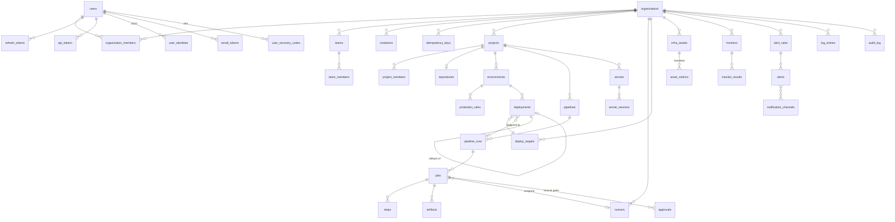

# Database design

PostgreSQL 17. Migrations live in `db/migrations` (golang-migrate, every `up` has a `down`) and are
embedded in the API binary. Queries live in `db/queries` and are compiled to Go by sqlc
(`make sqlc`); CI fails if generated code is stale.

## Conventions

| Rule | Detail |
|---|---|
| Primary keys | `uuid DEFAULT uuid_generate_v7()` (time-ordered; PG 17 has no native v7, see migration 000001) |
| Timestamps | `created_at`, `updated_at` as `timestamptz` (UTC); `updated_at` maintained by the `set_updated_at` trigger |
| Soft delete | `deleted_at timestamptz` on user-facing entities (users, orgs, teams, projects, environments, targets). Unique indexes are partial: `WHERE deleted_at IS NULL` |
| Flexible config | `jsonb` (org settings, pipeline definitions, target configs, alert rule params) |
| Enums | Postgres enums for small, stable sets (`member_role`); `text` + `CHECK` where values may grow |
| Case-insensitive text | `citext` for emails |
| Secrets at rest | Never plaintext: `bytea` ciphertext + key id (envelope encryption) |
| Foreign keys | Always declared, with an index on the referencing column |
| Append-only | `audit_log` rejects UPDATE/DELETE/TRUNCATE via trigger |
| Optimistic locking | Editable entities carry `version int NOT NULL DEFAULT 1`; updates use `WHERE id = $1 AND version = $2` and `SET version = version + 1`; 0 rows → `409 VERSION_CONFLICT` |
| Tenancy | Every tenant-owned table has `organization_id NOT NULL` (denormalized onto child tables such as jobs, deployments and secrets, so every query can filter by it directly) |

## Entity-relationship model

Implemented tables are marked **(✓ 000001)**. Everything else is the target design; each module adds
its tables in its own migration when it is built.



## Tables by module

### 1. Auth & users **(✓ 000001)**

| Table | Key columns | Notes |
|---|---|---|
| `users` | `email citext`, `password_hash`, `email_verified_at`, `locale ('en'\|'km')`, `timezone`, `khmer_numerals`, `totp_secret_enc`, `totp_enabled_at`, `is_platform_admin`, `disabled_at`, `version` | `password_hash` NULL for SSO-only users. Locale/timezone drive UI and notification language |
| `user_identities` | `provider`, `subject`, `user_id` | OIDC links; `UNIQUE (provider, subject)` |
| `sessions` | `user_id`, `auth_method (password\|oidc)`, `ip`, `user_agent`, `expires_at` (absolute, 30 days), `last_used_at`, `revoked_at`, `revoke_reason` | One signed-in device; the access JWT carries its id (`sid`). Revoking it ends the whole refresh-token family |
| `refresh_tokens` | `session_id`, `parent_id`, `token_hash bytea UNIQUE`, `expires_at` (14 days, sliding, capped by the session), `used_at` | Rotation: each refresh marks the token used and issues a child. Presenting a used token = **reuse** → the session is revoked |
| `mfa_challenges` | `user_id`, `token_hash`, `expires_at` (5 min), `used_at`, `attempts` | Bridges password step → TOTP step |
| lockout columns on `users` | `failed_login_count`, `lockout_level`, `locked_until` | 5 failures → 15 min lock, doubling per repeat (max 24 h); reset on success |
| `api_tokens` | `token_prefix`, `token_hash`, `scopes text[]`, `expires_at`, `last_used_at`, `revoked_at` | Format `ohp_<prefix>_<secret>` |
| `email_tokens` | `purpose (verify_email\|reset_password)`, `token_hash`, `expires_at`, `used_at` | Single use |
| `user_recovery_codes` | `code_hash`, `used_at` | TOTP backup codes |

### 2. Organizations, teams, RBAC **(✓ 000001 for org/team tables)**

| Table | Key columns | Notes |
|---|---|---|
| `organizations` | `slug`, `name`, `settings jsonb` | Tenant boundary. Every tenant-owned table carries `organization_id` |
| `organization_members` | `(organization_id, user_id)`, `role member_role` | `owner\|admin\|developer\|viewer` |
| `teams`, `team_members` | | Grouping for project access grants |
| `invitations` | `organization_id`, `email citext`, `role`, `token_hash`, `invited_by`, `expires_at` (7 days), `accepted_at`, `revoked_at` | |
| `idempotency_keys` | `organization_id`, `user_id`, `key`, `request_hash bytea`, `response_status`, `response_body jsonb`, `resource_id`, `created_at`, `expires_at` (24 h) | `UNIQUE (organization_id, user_id, key)`; purged by a River periodic job |
| `project_members` | `(project_id, user_id \| team_id)`, `role member_role` | Project-level role; see `docs/rbac.md` for resolution |

### 3. Projects & repositories

| Table | Key columns | Notes |
|---|---|---|
| `projects` | `organization_id`, `slug`, `name`, `default_branch` | |
| `repositories` | `project_id`, `provider (github\|gitlab)`, `external_id`, `clone_url`, `access_token_enc`, `webhook_secret_enc` | Token + webhook HMAC secret encrypted |
| `environments` | `project_id`, `name`, `kind (development\|staging\|production)`, `variables jsonb` | |
| `protection_rules` | `environment_id`, `required_approvals int`, `allowed_branches text[]`, `allowed_roles member_role[]` | e.g. prod requires 1 approval from Admin |
| `webhook_deliveries` | `repository_id`, `event`, `delivery_id UNIQUE`, `signature_valid`, `payload jsonb`, `received_at` | Idempotency + debugging |

### 4–5. Pipelines & runners

| Table | Key columns | Notes |
|---|---|---|
| `pipelines` | `project_id`, `name`, `definition_path` (`.opshub.yml`), `triggers jsonb`, `cron text` | |
| `pipeline_runs` | `pipeline_id`, `number` (per pipeline, `UNIQUE`), `status`, `trigger (push\|pull_request\|tag\|manual\|cron)`, `commit_sha`, `ref`, `definition jsonb` (snapshot), `created_by`, `started_at`, `finished_at` | Status: `queued\|running\|waiting_approval\|succeeded\|failed\|canceled` |
| `jobs` | `run_id`, `name`, `stage`, `needs text[]`, `image`, `status`, `runner_id`, `attempt`, `timeout_seconds`, `exit_code`, `started_at`, `finished_at` | `(run_id, name, attempt)` unique; retries create a new attempt |
| `steps` | `job_id`, `index`, `command`, `status`, `exit_code`, `duration_ms` | |
| `job_log_chunks` | `job_id`, `seq`, `content text`, `created_at` | Append-only chunks, streamed via SSE; secrets masked by the runner **and** API |
| `artifacts` | `job_id`, `path`, `size_bytes`, `sha256`, `storage_key`, `expires_at` | Blob storage pluggable (local disk / S3) |
| `approvals` | `job_id`, `user_id`, `decision (approved\|rejected)`, `comment` | Manual gates |
| `runners` | `organization_id`, `name`, `labels text[]`, `token_hash`, `version`, `os`, `arch`, `last_seen_at`, `max_concurrency`, `disabled_at` | Registered with a one-time token |
| `runner_registration_tokens` | `organization_id`, `token_hash`, `expires_at`, `used_at` | One-time |

| `job_tokens` | `job_id`, `token_hash`, `expires_at` (job timeout + 10 min) | Scopes runner calls to one job |
| `cache_entries` | `project_id`, `key`, `storage_key`, `size_bytes`, `last_used_at` | LRU-evicted per project quota |

Job dispatch uses `SELECT … FOR UPDATE SKIP LOCKED` on queued jobs matching runner labels, ordered by
`created_at`. Index: `jobs (organization_id, status, created_at) WHERE status = 'queued'`.

### 6. Deployments

| Table | Key columns | Notes |
|---|---|---|
| `deploy_targets` | `organization_id`, `name`, `kind (ssh\|docker\|kubernetes)`, `config jsonb`, `credentials_enc` | kubeconfig / SSH key encrypted |
| `deployments` | `environment_id`, `target_id`, `run_id`, `version`, `strategy (rolling\|blue_green)`, `status`, `health_check jsonb`, `rollback_of_id`, `created_by`, `started_at`, `finished_at` | Full release history; rollback = new deployment pointing at a previous one |

### 7. Infrastructure inventory

| Table | Key columns | Notes |
|---|---|---|
| `infra_assets` | `organization_id`, `kind (server\|cluster\|database\|domain)`, `name`, `address`, `tags text[]`, `metadata jsonb`, `agent_token_hash`, `last_heartbeat_at` | |
| `asset_metrics` | `asset_id`, `ts`, `cpu_pct`, `mem_pct`, `disk_pct` | Partitioned by month; downsampled by a retention job |
| `ssl_certificates` | `asset_id` (domain), `issuer`, `not_before`, `not_after`, `last_checked_at` | Expiry alerts |

### 8. Secrets

| Table | Key columns | Notes |
|---|---|---|
| `secrets` | `project_id`, `environment_id NULL` (= all envs), `name`, `current_version`, `deleted_at` | `UNIQUE (project_id, environment_id, name)` |
| `secret_versions` | `secret_id`, `version`, `ciphertext bytea`, `nonce bytea`, `dek_enc bytea`, `kek_id text`, `created_by` | Envelope encryption: random DEK per version (AES-256-GCM), DEK wrapped by the master key (KEK). Rotation = new version and/or re-wrap DEKs under a new KEK |

Every secret **read** (runner fetch or reveal) writes an `audit_log` row with action `secret.read`.

### 9. Monitoring & alerts

| Table | Key columns | Notes |
|---|---|---|
| `monitors` | `organization_id`, `kind (http\|tcp\|ssl)`, `target`, `interval_seconds`, `timeout_ms`, `expected jsonb` | Scheduled by River periodic jobs |
| `monitor_results` | `monitor_id`, `ts`, `up bool`, `latency_ms`, `error` | Partitioned by month |
| `alert_rules` | `organization_id`, `source (monitor\|metric)`, `condition jsonb`, `threshold`, `for_seconds`, `severity`, `escalation jsonb` | |
| `alerts` | `rule_id`, `status (firing\|resolved)`, `started_at`, `resolved_at`, `silenced_until`, `acknowledged_by` | Also feeds MTTR |
| `silences` | `organization_id`, `matchers jsonb`, `starts_at`, `ends_at`, `created_by` | |
| `notification_channels` | `organization_id`, `kind (telegram\|slack\|email\|webhook)`, `config_enc`, `locale NULL` | Channel locale overrides recipient locale |

### 10. Logs

| Table | Key columns | Notes |
|---|---|---|
| `log_entries` | `organization_id`, `source (service\|deployment\|job)`, `source_id`, `level`, `ts`, `message`, `attributes jsonb`, `search tsvector GENERATED` | Range-partitioned by day; GIN index on `search`; retention job drops partitions older than the configured window (default 30 days) |

Full-text search uses the `simple` configuration (language-agnostic, so Khmer and English content are
both indexed as tokens; log content is never translated).

### 11. Audit log **(✓ 000001)**

`audit_log(organization_id, actor_user_id, actor_type, action, resource_type, resource_id, ip, user_agent, before jsonb, after jsonb, metadata jsonb, created_at)`
— append-only, indexed by `(organization_id, created_at DESC)`, exported as CSV with keyset pagination.

### Job queue (River)

River's own tables (`river_job`, `river_leader`, `river_queue`, …) are created by River's migrator,
run from our migration pipeline as a pinned step (`cmd/api migrate` applies ours, then River's) so
schema changes stay versioned and reversible.

### 12. Dashboard & DORA metrics

Computed from existing tables (no new source of truth), materialized daily by a River job into
`dora_daily(organization_id, project_id, day, deployments, lead_time_p50_s, change_failures, mttr_s)`:

| Metric | Source |
|---|---|
| Deployment frequency | `deployments` succeeded to production environments per day |
| Lead time for changes | `deployments.finished_at` − commit time of `pipeline_runs.commit_sha` |
| Change failure rate | production deployments that were rolled back or followed by a firing alert / failed status ÷ total |
| MTTR | `alerts.resolved_at − started_at`, and failed-deploy → next-successful-deploy intervals |

## PostgreSQL roles (least privilege)

| Role | Privileges | Used by |
|---|---|---|
| `opshub_migrator` | Owns schema; DDL | `cmd/api migrate` (Helm pre-upgrade Job / `make migrate-up`) |
| `opshub_app` | `SELECT, INSERT, UPDATE, DELETE` on app tables; `INSERT, SELECT` only on `audit_log`; no `TRUNCATE`, no DDL | API + workers |
| `opshub_backup` | `pg_read_all_data` | Backup job |

In local dev a single superuser is used for convenience; `docker-compose.yml` creates the three roles to
mirror production.

## Seed data

`make seed` (`cmd/api seed`, idempotent) creates the demo org **Angkor Tech / អង្គរ តិច**:
users `owner@demo.opshub.local`, `admin@…`, `dev@…`, `viewer@…` (one per role; one with `locale=km`),
project **Payments API / API ទូទាត់ប្រាក់** with dev/staging/production environments (production
protected), a sample `.opshub.yml`, one successful and one failed run, deployments incl. a rollback,
infra assets, monitors and a firing alert. Descriptions are stored in both languages
(`"description": {"en": "…", "km": "…"}` in seed files; the UI shows the active language). Demo
passwords are printed once and only in development.

## Backup & restore

**Strategy:** nightly logical backups with `pg_dump --format=custom` (compressed, parallel restore),
retained 7 daily / 4 weekly / 3 monthly; backups encrypted at rest (age or storage-side encryption) and
copied off-host. For RPO below 24 h, enable WAL archiving/PITR (e.g. pgBackRest or a managed
Postgres). The secrets master key (KEK) is **not** in the database and must be backed up separately.
Without it, restored secrets cannot be decrypted.

```bash
# Backup (custom format, schema + data)
pg_dump --format=custom --no-owner --file=opshub-$(date -u +%Y%m%dT%H%M%SZ).dump "$OPSHUB_BACKUP_DATABASE_URL"

# Restore into an empty database, then verify
pg_restore --clean --if-exists --no-owner --jobs=4 --dbname="$TARGET_DATABASE_URL" opshub-<ts>.dump
opshub-api migrate status   # schema version must match the binary
```

Deliverables with the module work: `deploy/backup/backup.sh` + `restore.sh`, a `backup` service in
docker-compose (cron schedule), a Helm `CronJob` example, and a quarterly restore-drill runbook.
