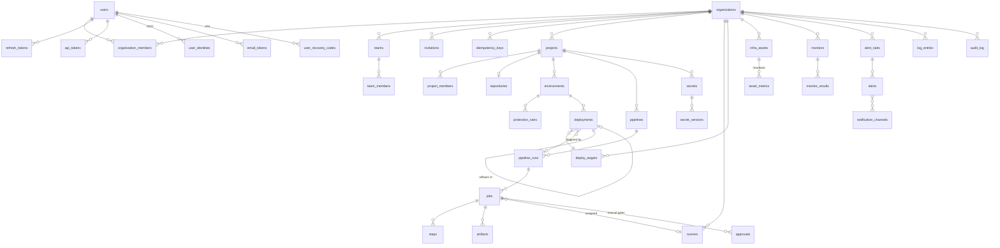

# Database design

PostgreSQL 17. Migrations live in `db/migrations` (golang-migrate, every `up` has a `down`) and are
embedded in the API binary. Queries live in `db/queries` and are compiled to Go by sqlc
(`make sqlc`); CI fails if generated code is stale.

## Conventions

| Rule | Detail |
|---|---|
| Primary keys | `uuid DEFAULT uuid_generate_v7()` (time-ordered; PG 17 has no native v7, see migration 000001) |
| Timestamps | `created_at`, `updated_at` as `timestamptz` (UTC); `updated_at` maintained by the `set_updated_at` trigger |
| Soft delete | `deleted_at timestamptz` on user-facing entities (users, orgs, teams, projects, environments, targets). Unique indexes are partial: `WHERE deleted_at IS NULL` |
| Flexible config | `jsonb` (org settings, pipeline definitions, target configs, alert rule params) |
| Enums | Postgres enums for small, stable sets (`member_role`); `text` + `CHECK` where values may grow |
| Case-insensitive text | `citext` for emails |
| Secrets at rest | Never plaintext: `bytea` ciphertext + key id (envelope encryption) |
| Foreign keys | Always declared, with an index on the referencing column |
| Append-only | `audit_log` rejects UPDATE/DELETE/TRUNCATE via trigger |
| Optimistic locking | Editable entities carry `version int NOT NULL DEFAULT 1`; updates use `WHERE id = $1 AND version = $2` and `SET version = version + 1`; 0 rows → `409 VERSION_CONFLICT` |
| Tenancy | Every tenant-owned table has `organization_id NOT NULL` (denormalized onto child tables such as jobs, deployments and secrets, so every query can filter by it directly) |

## Entity-relationship model

Implemented tables are marked **(✓ 000001)**. Everything else is the target design; each module adds
its tables in its own migration when it is built.

## Tables by module

### 1. Auth & users **(✓ 000001)**

| Table | Key columns | Notes |
|---|---|---|
| `users` | `email citext`, `password_hash`, `email_verified_at`, `locale ('en'\|'km')`, `timezone`, `khmer_numerals`, `totp_secret_enc`, `totp_enabled_at`, `is_platform_admin`, `disabled_at`, `version` | `password_hash` NULL for SSO-only users. Locale/timezone drive UI and notification language |
| `user_identities` | `provider`, `subject`, `user_id` | OIDC links; `UNIQUE (provider, subject)` |
| `sessions` | `user_id`, `auth_method (password\|oidc)`, `ip`, `user_agent`, `expires_at` (absolute, 30 days), `last_used_at`, `revoked_at`, `revoke_reason` | One signed-in device; the access JWT carries its id (`sid`). Revoking it ends the whole refresh-token family |
| `refresh_tokens` | `session_id`, `parent_id`, `token_hash bytea UNIQUE`, `expires_at` (14 days, sliding, capped by the session), `used_at` | Rotation: each refresh marks the token used and issues a child. Presenting a used token = **reuse** → the session is revoked |
| `mfa_challenges` | `user_id`, `token_hash`, `expires_at` (5 min), `used_at`, `attempts` | Bridges password step → TOTP step |
| lockout columns on `users` | `failed_login_count`, `lockout_level`, `locked_until` | 5 failures → 15 min lock, doubling per repeat (max 24 h); reset on success |
| `api_tokens` | `token_prefix`, `token_hash`, `scopes text[]`, `expires_at`, `last_used_at`, `revoked_at` | Format `ohp_<prefix>_<secret>` |
| `email_tokens` | `purpose (verify_email\|reset_password)`, `token_hash`, `expires_at`, `used_at` | Single use |
| `user_recovery_codes` | `code_hash`, `used_at` | TOTP backup codes |

### 2. Organizations, teams, RBAC **(✓ 000001 org/team tables, ✓ 000002 invitations)**

| Table | Key columns | Notes |
|---|---|---|
| `organizations` | `slug`, `name`, `settings jsonb` | Tenant boundary. Every tenant-owned table carries `organization_id` |
| `organization_members` | `(organization_id, user_id)`, `role member_role` | `owner\|admin\|developer\|viewer` |
| `teams`, `team_members` | `teams.description` (≤ 500), `teams.version` | Grouping for project access grants. `version` for optimistic locking (000002) |
| `invitations` | `organization_id`, `email citext`, `role`, `token_hash bytea UNIQUE`, `invited_by`, `expires_at` (7 days), `accepted_at`, `accepted_by`, `revoked_at` | At most one open invitation per `(organization_id, email)` (partial unique index). Only the token hash is stored |

### 3. Projects & repositories **(✓ 000003)**

| Table | Key columns | Notes |
|---|---|---|
| `projects` | `organization_id`, `slug` (unique per org among live projects), `name`, `description`, `default_branch`, `version`, `created_by`, `deleted_at` | Soft delete |
| `project_members` | `project_id`, `user_id` **or** `team_id` (exactly one), `role` (never `owner`) | Direct and team grants; removed when the user leaves the org or the team is deleted. See docs/rbac.md for resolution |
| `repositories` | `id` (app-generated, used as AES-GCM AAD), `project_id UNIQUE`, `provider (github\|gitlab)`, `base_url` (self-hosted, https only), `full_name`, `external_id`, `web_url`, `clone_url`, `default_branch`, `access_token_enc`, `webhook_secret_enc`, `webhook_mode (automatic\|manual)`, `webhook_id`, `last_delivery_at` | Token + webhook secret encrypted; `webhook_id` set iff OpsHub created the hook |
| `webhook_deliveries` | `repository_id`, `delivery_id`, `event`, `ref`, `commit_sha`, `signature_valid`, `payload jsonb` (valid and ≤ 1 MB only), `received_at` | Unique `(repository_id, delivery_id)` among **valid** deliveries, so forged requests can't block a real one. Purged after 30 days |
| `environments` | `project_id`, `name` (slug-like, unique per project among live ones), `kind (development\|staging\|production)`, `variables jsonb` (object, non-secret), `version`, `deleted_at` | ≤ 20 per project, ≤ 100 variables |
| `protection_rules` | `environment_id` PK, `required_approvals 0–10`, `allowed_branches text[]` (globs; empty = any), `allowed_roles member_role[]` | 1:1 with a protected environment |
| `idempotency_keys` | `user_id`, `key`, `request_hash`, `response_status`, `response_body`, `expires_at` (24 h) | Unique `(user_id, key)`; purged hourly |

### 4. Pipelines **(✓ 000004)**

One pipeline per project, defined in `.opshub.yml`; there is no `pipelines` table.

| Table | Key columns | Notes |
|---|---|---|
| `projects.last_run_number` | | Incremented under a row lock to number runs per project |
| `pipeline_runs` | `project_id`, `number` (`UNIQUE` per project), `status (queued\|running\|waiting\|succeeded\|failed\|canceled)`, `trigger (push\|pull_request\|tag\|manual\|schedule)`, `ref`, `commit_sha`, `title`, `actor_name`, `created_by`, `rerun_of`, `definition jsonb` (snapshot), `problems jsonb` (invalid file), `variables jsonb`, `started_at`, `finished_at` | Status is derived from the jobs by the engine |
| `pipeline_jobs` | `run_id`, `organization_id`, `name`, `stage`, `stage_index`, `needs text[]` (resolved), `condition`, `environment`, `environment_id`, `runs_on text[]`, `spec jsonb`, `status (created\|waiting_approval\|queued\|running\|succeeded\|failed\|canceled\|skipped)`, `attempt`, `runner_id`, `timeout_seconds`, `exit_code`, `failure_reason`, `log_bytes` | One row per attempt, `UNIQUE (run_id, name, attempt)`; the highest attempt is current. Dispatch index `(organization_id, queued_at) WHERE status = 'queued'` |
| `job_steps` | `(job_id, index)`, `name`, `command`, `status`, `exit_code`, timings | |
| `job_log_chunks` | `(job_id, seq)`, `content` | Runner-chosen `seq` makes uploads idempotent; masked before insert; ≤ 10 MiB per job |
| `job_approvals` | `job_id`, `user_id`, `decision`, `comment` | `UNIQUE (job_id, user_id)` |
| `pipeline_schedules` | `project_id`, `cron`, `next_run_at`, `last_run_at` | Synced from the default branch's file; a minute tick enqueues due ones |

### 5. Runners **(✓ 000005)**

| Table | Key columns | Notes |
|---|---|---|
| `runners` | `organization_id`, `name`, `labels text[]`, `token_hash` (`UNIQUE`), `token_prefix`, `version`, `os`, `arch`, `max_concurrency (1–64)`, `last_seen_at`, `disabled_at`, `row_version` | Registered with a one-time token; `pipeline_jobs.runner_id` references it (`ON DELETE SET NULL`) |
| `runner_registration_tokens` | `organization_id`, `token_hash`, `labels`, `expires_at`, `used_at`, `runner_id` | One-time, 1 h; purged 7 days after expiry |
| `job_tokens` | `job_id` (PK), `token_hash`, `expires_at` (job timeout + 10 min) | Issued in the claim transaction; scopes runner calls to one job |
| `artifacts` | `job_id` (`UNIQUE`), `project_id`, `organization_id`, `name`, `size_bytes`, `sha256`, `storage_key`, `expires_at` | One gzip tar per job in the local blob store (D5); expired rows and blobs are removed by housekeeping |
| `cache_entries` | `(project_id, key)` `UNIQUE`, `storage_key`, `size_bytes`, `sha256`, `last_used_at` | Least recently used entries beyond the project quota are evicted |

Tokens are stored as SHA-256 hashes only. Blobs live under `OPSHUB_BLOB_DIR`
(`artifacts/<project>/<job>-<random>.tar.gz`, `cache/<project>/<random>`); a replaced cache
entry's old blob is deleted after the new one is recorded.

### 6. Deployments **(✓ 000006)**

| Table | Key columns | Notes |
|---|---|---|
| `deploy_targets` | `organization_id`, `name` (`UNIQUE` per org), `kind (ssh\|docker\|kubernetes)`, `description`, `config jsonb`, `credentials_enc`, `last_test_at`, `last_test_ok`, `version` | Credentials: AES-GCM with the master key ring, the row id as associated data; never returned |
| `deployments` | `project_id`, `environment_id`, `number` (`UNIQUE` per project), `target_id` (`SET NULL`), `target_name`, `target_kind`, `version`, `previous_version`, `strategy (rolling\|blue_green)`, `status (pending\|running\|succeeded\|failed)`, `failure_reason`, `reverted`, `health jsonb`, `run_id`, `job_id`, `rollback_of_id`, `created_by`, timings | Full release history; one active deployment per environment (partial unique index); a rollback is a new row pointing at the one it replaces |
| `deployment_log_chunks` | `(deployment_id, seq)`, `content` | ≤ 5 MiB per deployment |
| `environments.current_deployment_id` | | The release the environment runs now |
| `projects.last_deployment_number` | | Numbers deployments per project |

### 7. Infrastructure inventory **(✓ 000007)**

| Table | Key columns | Notes |
|---|---|---|
| `infra_assets` | `organization_id`, `kind (server\|cluster\|database\|domain)`, `name` (`UNIQUE` per org), `address`, `description`, `tags text[]` (≤ 20), `metadata jsonb`, `tls_port`, `agent_token_hash` (`UNIQUE`), `agent_token_prefix`, `agent_version/hostname/os/arch`, `last_heartbeat_at`, `last_metrics jsonb`, `version` | `updated_at` changes only with `version` (edits, token rotation), not with heartbeats |
| `asset_metrics` | `(asset_id, ts)`, `cpu_pct`, `mem_pct`, `disk_pct`, `load1` | `PARTITION BY RANGE (ts)`, one partition per month (`asset_metrics_YYYYMM`); current + previous month kept |
| `asset_metrics_hourly` | `(asset_id, hour)`, average and peak per metric | Rollups kept 400 days |
| `ssl_certificates` | `asset_id` (domain, PK), `host`, `port`, `subject`, `issuer`, `dns_names`, `serial`, `fingerprint`, `not_before`, `not_after`, `error`, `last_checked_at`, `next_check_at` | Last known dates survive a failed check |

`opshub_maintain_metric_partitions(keep_months)` creates this month's and the next two months'
partitions and drops older ones. It is `SECURITY DEFINER` (owned by `opshub_migrator`,
`search_path` pinned, `EXECUTE` revoked from `PUBLIC` and granted to `opshub_app`), so the hourly
job can maintain partitions while the application role keeps no DDL rights.

### 8. Secrets **(✓ 000008)**

| Table | Key columns | Notes |
|---|---|---|
| `secrets` | `project_id`, `environment_id NULL` (= all environments), `name`, `description`, `current_version`, `version`, `created_by`, `deleted_at` | Unique `(project_id, environment_id, name) NULLS NOT DISTINCT` among live secrets; name checked in SQL too |
| `secret_versions` | `(secret_id, version)`, `ciphertext`, `nonce`, `dek_enc`, `kek_id`, `created_by`, `destroyed_at` | Envelope encryption: a random DEK per version (AES-256-GCM, aad `secret:<id>:<version>`), the DEK sealed by the master key ring (`kek_id`). Rotation and deletion set the value columns to NULL and `destroyed_at` |
| `job_tokens.masks_enc` | | A running job's values to mask, sealed by the key ring (aad `job-masks:<job id>`), so the API masks stored output too |

Every value a runner receives writes an `audit_log` row with action `secret.read`.
`opshub-api keys rotate` re-encrypts every key-ring column under the active master key
([secrets.md](secrets.md#rotating-the-master-key)).

### 9. Monitoring & alerts **(✓ 000009)**

| Table | Key columns | Notes |
|---|---|---|
| `monitors` | `organization_id`, `name` (unique), `kind (http\|tcp\|ssl)`, `target`, `interval_seconds`, `timeout_ms`, `config jsonb`, `labels`, `enabled`, `last_up`, `last_latency_ms`, `last_error`, `down_since`, `next_check_at`, `version` | Due checks are claimed with `FOR UPDATE SKIP LOCKED` and rescheduled in one statement; `updated_at` changes only with `version` |
| `monitor_results` | `(monitor_id, ts)`, `up`, `latency_ms`, `status_code`, `error` | `PARTITION BY RANGE (ts)`, monthly; current + previous month kept |
| `monitor_results_hourly` | `(monitor_id, hour)`, `checks`, `up_checks`, `latency_avg`, `latency_max` | Kept 400 days |
| `alert_rules` | `organization_id`, `name` (unique), `kind (monitor_down\|monitor_latency\|asset_metric\|asset_offline\|certificate)`, `target_id`, `label`, `threshold`, `metric`, `for_seconds`, `severity (info\|warning\|critical)`, `escalation jsonb`, `enabled` | Escalation: `[{after_minutes, channel_ids[]}]` |
| `alerts` | `rule_id` (`SET NULL`), `rule_name`, `rule_kind`, `severity`, `subject_type (monitor\|asset)`, `subject_id`, `subject_name`, `subject_labels`, `status (pending\|firing\|resolved)`, `details jsonb`, `pending_since`, `started_at`, `resolved_at`, `acknowledged_by/at`, `next_step`, `next_step_at` | One open alert per rule and subject (partial unique index); resolved alerts are history (MTTR in Module 12) |
| `alert_events` | `alert_id`, `at`, `kind`, `channel_id`, `channel_name`, `user_id`, `detail` | The alert's timeline |
| `silences` | `organization_id`, `rule_id`, `subject_id`, `label`, `severity`, `comment`, `starts_at`, `ends_at`, `created_by` | At least one matcher (CHECK) |
| `notification_channels` | `organization_id`, `name` (unique), `kind (telegram\|slack\|email\|webhook)`, `config jsonb`, `secrets_enc`, `locale NULL`, `last_test_at/ok`, `version` | Credentials sealed by the key ring (aad = id); channel locale overrides the recipient's |

`opshub_maintain_monitor_partitions(keep_months)` is the monitor counterpart of the
metric-partition function (`SECURITY DEFINER`, `EXECUTE` granted to `opshub_app` only).

### 10. Logs **(✓ 000010)**

| Table | Key columns | Notes |
|---|---|---|
| `log_entries` | `(ts, id)`, `organization_id`, `source (service\|job\|deployment)`, `source_id`, `project_id`, `service`, `level (debug\|info\|warn\|error)`, `message`, `attributes jsonb`, `search tsvector GENERATED` | `PARTITION BY RANGE (ts)`, one partition per UTC day; index `(organization_id, ts DESC, id DESC)` and GIN on `search`; partitions older than `OPSHUB_LOG_RETENTION_DAYS` are dropped |
| `log_ingest_tokens` | `organization_id`, `name` (unique), `service`, `token_hash` (unique), `token_prefix`, `created_by`, `last_used_at` | Only the hash is stored; `last_used_at` is written at most once a minute |

Full-text search uses the `simple` configuration (language-agnostic, never stemmed; log content is
never translated) over `service` and `message`, with `/ : = .` turned into spaces so paths, hosts
and `key=value` pairs are searchable by their parts. Khmer has no spaces between words, so queries
in Khmer script use `ILIKE` on `message` instead.

Triggers on `job_log_chunks` and `deployment_log_chunks` copy each non-empty line into
`log_entries` (ANSI colours removed; red lines are `error`). Errors in the copy are caught and
raised as warnings, so the original insert always succeeds.
`opshub_maintain_log_partitions(keep_days)` creates partitions from 7 days back to 2 days ahead
and drops expired ones (`SECURITY DEFINER`, `EXECUTE` granted to `opshub_app` only).

### 11. Audit log **(✓ 000001, indexes 000011)**

`audit_log(organization_id, actor_user_id, actor_type, action, resource_type, resource_id, ip, user_agent, before jsonb, after jsonb, metadata jsonb, created_at)`
— append-only (triggers refuse UPDATE/DELETE/TRUNCATE; `opshub_app` has INSERT and SELECT only) and
kept forever. Project-scoped entries carry `metadata.project_id`; account events have no
organization. Indexes: `(organization_id, created_at DESC)`, plus from 000011
`(organization_id, split_part(action, '.', 1), created_at DESC, id DESC)` for areas,
`(organization_id, metadata->>'project_id', …)` for projects, `(organization_id, actor_user_id, …)`
for people, and `(resource_id, created_at DESC, id DESC) WHERE organization_id IS NULL AND
resource_type = 'user'` for account activity. The viewer and the CSV export page with keyset
cursors on `(created_at, id)`.

### Job queue (River)

River's own tables (`river_job`, `river_leader`, `river_queue`, …) are created by River's migrator,
run from our migration pipeline as a pinned step (`cmd/api migrate` applies ours, then River's) so
schema changes stay versioned and reversible.

### 12. Dashboard & DORA metrics **(✓ 000012)**

Computed on request from existing tables (no new source of truth and no materialized copy, so
figures are current and medians exact over any range up to 366 days; decision M12-5). 000012
adds `pipeline_runs.committed_at` (the commit's time from the Git host, NULL when unknown) and
indexes on `pipeline_runs (organization_id, created_at)`, `deployments (organization_id,
created_at)`, `deployments (rollback_of_id)`, `deployments (environment_id, finished_at) WHERE
status = 'succeeded'` and `alerts (organization_id, resolved_at) WHERE status = 'resolved'`.

A **change** is a finished deployment (succeeded or failed) to an environment of kind
`production` (or one chosen environment), excluding rollbacks (`rollback_of_id IS NOT NULL`).

| Metric | Source |
|---|---|
| Deployment frequency | Successful changes ÷ days in the range |
| Lead time for changes | `deployments.finished_at` − `COALESCE(pipeline_runs.committed_at, pipeline_runs.created_at)` of successful changes with a run (median, p95) |
| Change failure rate | Changes that failed or were rolled back later (a deployment with `rollback_of_id` = the change) ÷ changes |
| Time to restore | Failed change → its automatic revert (`reverted`) or the next successful deployment to that environment; a rolled-back change from its `finished_at` (median; unrestored changes counted as open) |
| Alert recovery (org-wide) | `alerts.resolved_at − started_at` for alerts resolved in the range (median) |

## PostgreSQL roles (least privilege)

| Role | Privileges | Used by |
|---|---|---|
| `opshub_migrator` | Owns schema; DDL | `cmd/api migrate` (Helm pre-upgrade Job / `make migrate-up`) |
| `opshub_app` | `SELECT, INSERT, UPDATE, DELETE` on app tables; `INSERT, SELECT` only on `audit_log`; no `TRUNCATE`, no DDL (metric, monitor and log partitions via `SECURITY DEFINER` functions, §7, §9 and §10) | API + workers |
| `opshub_backup` | `pg_read_all_data` (read-only) | Backup job (`opshub-backup`) |

In local dev a single superuser is used for convenience; `docker-compose.yml` creates the three roles to
mirror production.

## Seed data

`make seed` (`cmd/api seed`, idempotent) creates the demo org **Angkor Tech / អង្គរ តិច**:
users `owner@demo.opshub.local`, `admin@…`, `dev@…`, `viewer@…` (one per role; one with `locale=km`),
project **Payments API / API ទូទាត់ប្រាក់** with dev/staging/production environments (production
protected), a sample `.opshub.yml`, one successful and one failed run, deployments incl. a rollback,
infra assets, monitors and a firing alert, a log ingest token with recent checkout-service lines, and the `checkout-web` project with 60 days
of runs and production deployments for the dashboard. Descriptions are stored in both languages
(`"description": {"en": "…", "km": "…"}` in seed files; the UI shows the active language). Demo
passwords are printed once and only in development.

## Backup & restore

**Strategy:** nightly logical backups with `pg_dump --format=custom` (compressed, parallel restore),
retained 7 daily / 4 weekly / 3 monthly; backups encrypted at rest (age or storage-side encryption) and
copied off-host. For RPO below 24 h, enable WAL archiving/PITR (e.g. pgBackRest or a managed
Postgres). The secrets master key (KEK) is **not** in the database and must be backed up separately.
Without it, restored secrets cannot be decrypted.

**Built (Module 12b):** `deploy/backup/backup.sh` and `restore.sh` in the `opshub-backup` image,
the opt-in compose `backup` service (daily at `OPSHUB_BACKUP_AT`), the Helm `CronJob`, and the
quarterly restore-drill runbook. Backups are always encrypted with age to public keys and can be
copied to S3-compatible storage with rclone. `make backup-drill` (also in CI) restores into a
scratch database and compares row counts. Operating guide: [backup.md](backup.md).
